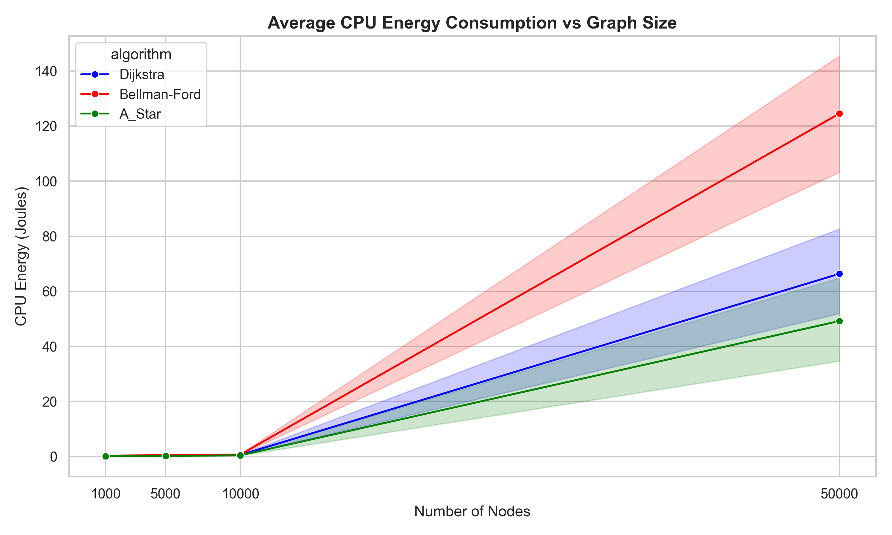
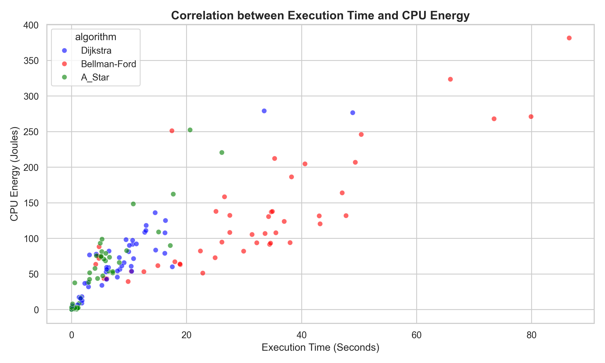
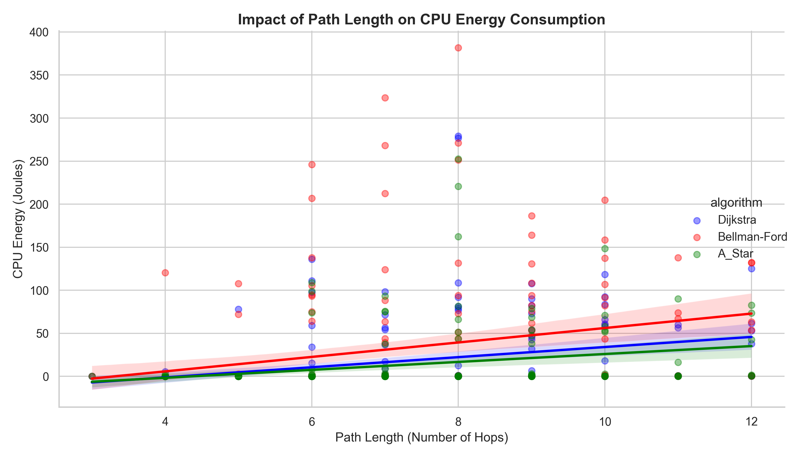
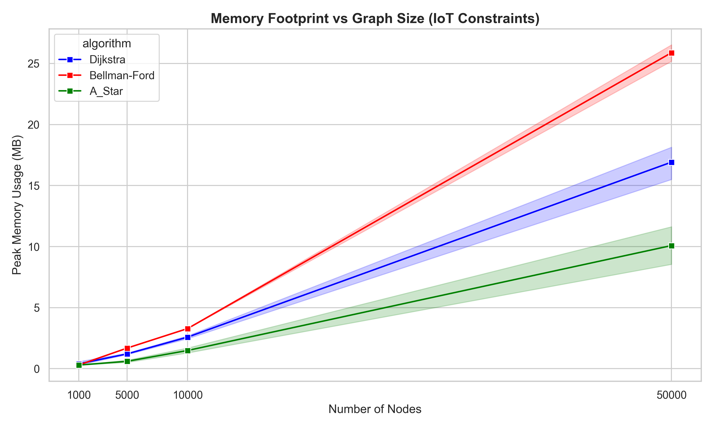
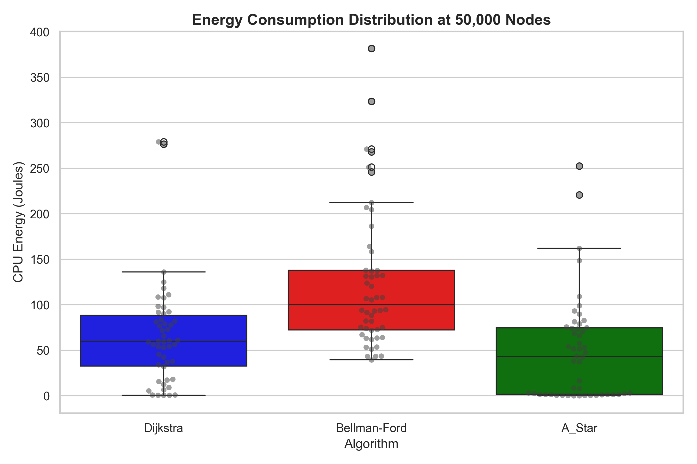

# comparative-energy-shortest-path
การวิเคราะห์เปรียบเทียบการใช้พลังงานของอัลกอริทึมการหาเส้นทางที่สั้นที่สุด: กรณีศึกษาดิกสตรา, เบลแมน-ฟอร์ด และเอสตาร์

- `data/`               เก็บไฟล์กราฟสังเคราะห์ (Synthetic Graphs .gml) ที่ใช้ในการทดสอบ
- `results/`            เก็บไฟล์ผลลัพธ์ดิบ (CSV) และไฟล์ log ของ CodeCarbon
- `src/`                โค้ดหลักที่ใช้รันอัลกอริทึม สร้างกราฟ และเก็บข้อมูล 
- `notebooks/`          Jupyter Notebook สำหรับการทำ Data Analysis และสร้างภาพ Data Visualization
- `fig/`                รูปภาพกราฟผลการศึกษาที่ใช้ในรายงาน

`จุดประสงค์`
  - เพื่อศึกษา วิเคราะห์ และเปรียบเทียบประสิทธิภาพเชิงประจักษ์ (Empirical Performance) ของอัลกอริทึม Dijkstra, Bellman-Ford และ A* 
  - เปรียบเทียบในมิติของเวลาที่ใช้ (Execution Time), การบริโภคพลังงานไฟฟ้าของ CPU (Energy Consumption) และการใช้พื้นที่หน่วยความจำสูงสุด (Peak Memory Usage) 
  - เพื่อนำเสนอแนวทางในการเลือกใช้อัลกอริทึมที่เหมาะสมสำหรับอุปกรณ์ที่มีข้อจำกัดด้านทรัพยากร เช่น ระบบ IoT และ WSN

`ขอบเขตและสภาพแวดล้อมที่ใช้ทดสอบ`
  - **CPU:** Intel Core i5-1145G7 
  - **RAM:** DDR4 16 GB ความเร็ว 3200 MHz 
  - **ข้อมูลจำลอง:** กราฟสุ่มเชิงสังเคราะห์แบบระบุพิกัดเชิงพื้นที่ (Spatial Synthetic Random Graphs) เพื่อให้สอดคล้องกับพฤติกรรมการเดินทางในระบบนำทางจริง

`วิธีการ`
  - จำลองกราฟทดสอบ 4 ระดับ เพื่อประเมิน Scalability: 1,000, 5,000, 10,000 และ 50,000 โหนด 
  - สุ่มจุดต้นทาง (Source) และปลายทาง (Target) จำนวน 50 คู่ที่ไม่ซ้ำกันในแต่ละขนาดกราฟ 
  - ใช้ `CodeCarbon` วัดพลังงาน CPU (Joules), `Tracemalloc` วัด Peak Memory (MB), และบันทึกเวลาที่ใช้ประมวลผล (Seconds)

`ผลการศึกษา`
  - **การขยายตัวด้านพลังงาน (Energy Scalability):** A* เป็นอัลกอริทึมที่บริโภคพลังงานเฉลี่ยน้อยที่สุดและมีการเติบโตของพลังงานต่ำกว่า Dijkstra และ Bellman-Ford อย่างชัดเจนเมื่อโหนดเพิ่มถึง 50,000 โหนด
    - 

  - **ความสัมพันธ์ระหว่างเวลากับพลังงาน:** พบความสัมพันธ์เชิงบวกแบบเชิงเส้น (Positive Linear Correlation) อย่างมีนัยสำคัญ ยิ่งประมวลผลนานยิ่งสูบพลังงานเยอะ โดย A* เกาะกลุ่มอยู่ในโซนประสิทธิภาพสูงสุด
    - 

  - **ผลกระทบของระยะทาง:** A* รักษาระดับพลังงานได้คงที่และมีความชันต่ำที่สุด (แบนราบ) แม้เป้าหมายจะอยู่ไกล (Hops เพิ่มขึ้น) ด้วยพลังของ Heuristic Function
    - 

  - **การใช้ทรัพยากรหน่วยความจำ:** A* ใช้พื้นที่ RAM น้อยที่สุด (ประมาณ 10 MB ที่ 50,000 โหนด) ตอบโจทย์อุปกรณ์ IoT
    - 

  - **การกระจายตัวและความเสถียร:** Bellman-Ford เกิดภาวะดึงพลังงานฉับพลัน (Power Spikes) สูงกว่า 300 จูล ในขณะที่ A* มีความเสถียรสูงและคาดเดาพลังงานที่ใช้ได้แม่นยำกว่า
    - 
  
`ref`
  - Abusalim, S., et al. Comparative Analysis between Dijkstra and Bellman-Ford Algorithms in Shortest Path Optimization (2020).
  - Ayari, M., et al. Optimizing Communication Network Routing with A* Algorithm: A Comparative Study (2021).
  - Aldhafferi, N. Time and Memory Trade-Offs in Shortest-Path Algorithms Across Graph Topologies (2025).
  - AJRCOS. A Comprehensive Review of Shortest Path Algorithms for Network Routing (2025). 
  - Rahman, M. M., & Islam, M. S. Comparative Study of Shortest Path Algorithms for Energy Efficient Routing in WSN (2025).
  - Sharma S., & Kumar, S. Comparative Analysis of Manhattan and Euclidean Distance Metrics Using A* Algorithm (2016).